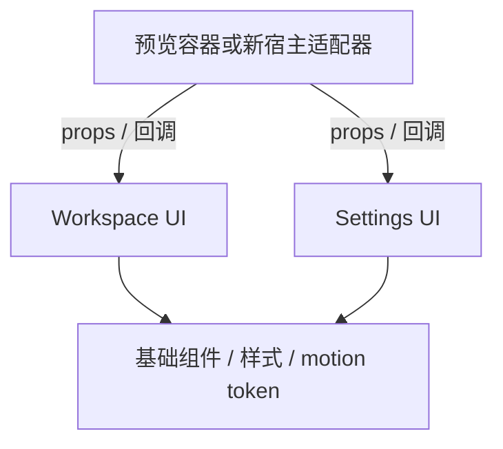

# UI 参考边界与新 App 的连接方式

本文件解释现有两份 UI 副本的用途。新产品行为以[需求](../docs/requirements.md)、[UI 设计](../docs/ui-design.md)及[架构](../docs/architecture.md)为准。

## 1. 当前真实存在的内容

[UI_INVENTORY.json](UI_INVENTORY.json)记录提取来源版本 `edf056b992ad3736e7ede19eb6ab0d508d6e700e`。本目录保留 WorkspaceUI、GeneralSettingsUI、本地基础组件、样式、动效 token、七个 SVG 和独立预览容器。

WorkspaceUI 不导入 GeneralSettingsUI；两者通过外部 props/回调连接。`CoreUI.tsx` 仅导出这两个页面；[边界检查](scripts/check-ui-boundaries.mjs)验证它们不依赖 Tauri、网络、旧 controller 或预览存储。

此前的完整 App 运行时不是当前目录的一部分。历史版本中使用过的 controller、Rust/Swift、账号和跨窗口机制不作为新 App 的实现基础。

## 2. 两个页面的现有限制

| 参考界面 | 现有行为 | 新 App 需要提供 |
|---|---|---|
| 工作区侧栏和导航 | 部分入口未绑定回调，处于不可操作状态 | 真实路由、能力状态与管理入口 |
| 六张文件能力卡片 | 静态文案 | 能力目录、依赖状态和可检查执行结果 |
| “概览”标题与能力内容 | 按旧截图组合保留 | 新概览与能力库分工，消除标题回退语义 |
| 账号区 | “未登录 / 通过 GitHub 登录”外观 | 移除 App 登录依赖，使用模型与 API 配置 |
| 侧边终端 | P1 静态占位 | 首版持续 PTY 及新终端面板 |
| 通用设置 | 五个值的 props/patch | 完整设置合同、版本、保存失败与宿主副作用 |
| 快捷键录入 | 前端识别按键后发回调 | 原生注册、冲突、失败恢复与真实成功状态 |
| 弹窗连接 | 同一 React 树共享预览数据 | Rust 持久状态与 IPC，同步独立窗口 |
| 输入条/任务/会话 | 本目录没有实现 | 按视频及新需求重建 |

旧示例的 Finder 自动显示与移动隐藏文案可以辅助理解外观；新需求已经明确 manual/followFinder、自动 cd、keepAll/endAll 等完整行为，不能由旧表单默认值推导。

## 3. 可保留的组件边界

UI 只表达“用户要打开设置、更新字段或导航”，不负责执行原生动作。预览宿主可以是本地 React 容器；正式宿主将请求交给 Rust 服务后，以已提交状态更新页面。

新工作区、设置、输入条和任务浮层可以处于不同原生窗口，各自的 React 内存不能作为全局状态。新会话、设置和任务由 Rust 管理，窗口通过版本化快照与事件协调；高频终端输出使用专门流接口。

## 4. 复用与验证

优先复用视觉规律和本地基础组件 API，再接入新 ViewModel；不要复制 localStorage、静态账号、示例 controller 或过时的 Settings 数据形状作为业务实现。

对照原始截图验证尺寸、间距、颜色、字体、焦点和动效；新输入条/终端按[UI 设计](../docs/ui-design.md)的证据与新增状态验证。现有四个 Playwright 用例仅证明参考页面的有限交互，不覆盖真实文件、终端、原生窗口或新 App。
