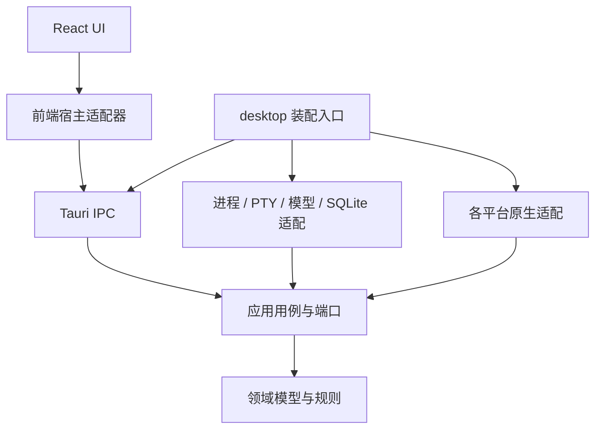
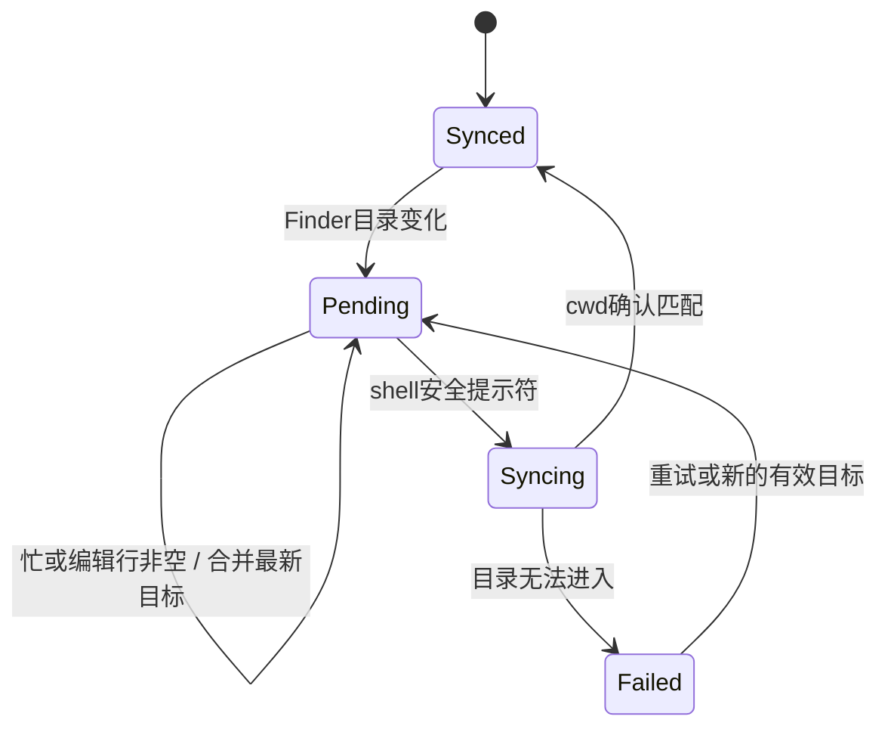

# Fleqi 架构与接口合同

版本：1.2 · 日期：2026-09-16。合同覆盖完整产品；各阶段实际状态见[实施状态](status.md)。

产品范围以[需求文档](requirements.md)为准，操作范围见[能力台账](capabilities.md)，界面见[UI 设计](ui-design.md)，实施与验收见[开发计划](development-plan.md)。本文中的目录、类型、接口和存储表是待实现合同，不表示当前仓库已有这些代码。

## 1. 架构决定

| 决定 | 采用方案 | 实现目的 |
|---|---|---|
| ADR-001 · 桌面宿主 | Tauri 2；Rust 主进程；React + TypeScript + Vite | 同一工程构建 Web UI 与本地能力，macOS 首发，Windows/Linux 通过适配层接入 |
| ADR-002 · 模块组织 | Rust workspace，领域、应用编排、基础设施、平台适配分离 | 领域规则可脱离 UI、数据库和平台测试；新增平台不复制业务 |
| ADR-003 · 终端 | `portable-pty` + `@xterm/xterm`、`@xterm/addon-fit` | 实现真实交互程序、持续 shell、输入、输出与尺寸调整 |
| ADR-004 · 两条执行通道 | AI 一次性任务使用 ProcessRunner；手动终端使用 TerminalManager | AI 策略只作用于 AI；终端前台程序保持完整输入语义 |
| ADR-005 · 持久化 | SQLite + 版本化迁移；大输出分文件；系统凭据存储 | 会话与任务可追溯，密钥不进入普通数据库和前端持久状态 |
| ADR-006 · 消息传输 | Tauri command 处理请求；Channel 传输出；事件通知状态版本变化 | 高频输出和低频状态分别处理，窗口可重新连接 |
| ADR-007 · 文件管理器集成 | 平台适配产出不可变 ContextSnapshot | Finder 对象、窗口句柄不跨入 UI 与领域层 |
| ADR-008 · 目录同步 | 当前可见会话跟随 Finder；终端忙时排队到安全提示符 | 保证自动进入新目录，同时不向交互程序输入错误指令 |
| ADR-009 · 发布 | macOS 直接分发签名 App/DMG；AGPL-3.0-only；Windows/Linux 后续里程碑 | 先完成真实原生体验；每个平台单独验证安装和宿主能力 |

Tauri 的主进程可管理窗口、全局状态与 IPC，WebView 承担 UI；三个桌面系统使用各自 WebView 引擎，因此共享前端仍需实际宿主验收。[官方进程模型](https://v2.tauri.app/concept/process-model/)

终端库提供跨平台 PTY 接口；Fleqi 仍需实现会话所有权、退出清理、输出限制与平台验收，不能把“库可编译”记为产品已经支持该平台。[portable-pty](https://docs.rs/portable-pty/latest/portable_pty/)

## 2. 目标工程结构与依赖方向

P0 建立以下独立工程入口；各模块的业务随 M1–M5 增量实现。

```text
apps/desktop/                 Tauri 启动、配置、窗口、IPC 注册、依赖装配
packages/ui/                  React 页面、组件、样式、界面状态
packages/contracts/           从 Rust DTO 生成的 TypeScript 类型
crates/fleqi-domain/           实体、值对象、状态转换、执行策略
crates/fleqi-application/      用例、端口、会话/任务编排
crates/fleqi-adapters/         process、terminal、model、storage、工具下载
crates/fleqi-platform/         macos、windows、linux 原生适配
resources/catalog/            参数化能力数据、工具清单、提示词版本
resources/icons/              经核对的发布图标
tests/                        跨模块及真实宿主验收
docs/                         当前开发合同
Web APP/                      保留的 UI 参考工程
Icon/                         保留的图标设计源
```



图中的依赖箭头表示代码依赖。基础设施实现应用层端口；应用层通过注入的端口调用它们。运行时调用不改变代码依赖方向。

- `fleqi-domain` 不依赖 Tauri、HTTP、SQLite、系统窗口或 React。
- `fleqi-application` 只依赖领域模型与自身声明的端口，不通过全局宿主对象取得任意能力。
- `fleqi-adapters` 和 `fleqi-platform` 不相互直接调用；跨模块工作经用例编排。
- UI 组件通过 props、回调和最小 ViewModel 工作；只有宿主适配器调用 IPC。预览适配器提供固定数据，不接真实进程、网络或文件写入。
- `apps/desktop` 负责创建与连接模块，不成为持有全部业务行为的 controller。
- 前端使用 pnpm、Tailwind CSS v4、Radix、本地 shadcn 风格组件、Lucide 和集中 motion token；`xterm.js` 按需加载。

## 3. 模块职责与端口

| 模块名 | 所有权与职责 | 关键端口/输出 |
|---|---|---|
| application | SessionRegistry、RunRegistry、用户动作排序、生命周期 | SessionService、RunService、SettingsService |
| catalog | 能力定义、文件类型/数量过滤、参数约束、别名、本地检索 | CatalogPort、CapabilityDefinition |
| planner | 本地模板或模型生成 ExecutionPlan；参数补齐；计划修订 | PlannerPort |
| policy | AI 计划副作用分类、确认判定、确认版本检查 | PolicyDecision |
| process | 一次性进程、argv/cwd/env、取消、输出、退出码 | ProcessPort、ProcessEvent |
| terminal | PTY、shell、原始输入、尺寸、前台状态、目录同步 | TerminalPort、TerminalEvent |
| model | 用户端点、模型配置、流式生成与摘要、取消 | ModelPort |
| tools | 工具检测、下载验证、安装清单、版本与卸载归属 | ToolRegistryPort、ToolInstallerPort |
| storage | SQLite 单写入队列、记录查询、迁移、输出文件 | Repository ports、OutputStore |
| platform | Finder、窗口、快捷键、权限、凭据、托盘、系统操作 | ContextPort、WindowPort、HotkeyPort、CredentialPort |

应用编排采用每会话消息队列及每任务独立取消令牌。数据库由单一写入服务排序事务；长 HTTP、进程等待、PTY I/O 不持有全局状态锁。阻塞库调用放入专用线程或 Tokio blocking executor，不能阻塞原生 UI 主线程。

## 4. 公共数据模型

Rust DTO 使用 serde，TypeScript 类型用 ts-rs 从同一 DTO 定义生成。实体 ID 为不透明字符串；时间为 UTC RFC 3339；跨 IPC 的版本与流序号使用十进制字符串，避免 JavaScript 整数精度损失。路径显示文本和原生路径引用分开；非 UTF-8 文件名不能通过有损显示文本往返执行。

| 类型 | 必须包含的字段与意义 |
|---|---|
| ContextSnapshot | `id`、`revision`、`source`（finder/picker）、`sourceWindowId?`、`directoryRef?`、`selectedItems[]`、`viewKind`（physical/virtual/desktop）、`capturedAt`、`availability` |
| PathRef | `id`、`displayPath`、`kind`；Rust 端绑定原始 PathBuf/平台标识。前端和模型引用 ID，不把显示名称当真实路径 |
| Session | `id`、`parentSessionId?`、`title`、`state`、`initialDirectoryRef`、`currentDirectoryRef`、`targetDirectoryRef?`、`directorySync`、`terminalId?`、`pinned`、`createdAt`、`lastUsedAt`、`endedAt?`、`revision` |
| ConversationEntry | `id`、`sessionId`、`role`、`content`、`runId?`、`createdAt`；普通 AI 对话与手动命令记录带明确来源 |
| Run | `id`、`sessionId`、`origin`、`prompt`、`contextSnapshot`、`planRevision`、`state`、`progress`、`outputRef`、`itemResults[]`、`exitStatus?`、`summaryState`、`timestamps` |
| ExecutionPlan | `id`、`revision`、`capabilityId?`、`contextId`、`steps[]`、`requiredTools[]`、`effects[]`、`previewCompleteness`、`sourceFingerprint` |
| ExecutionStep | `kind`（native/process/script）、`operation/ executableRef/ script`、`args`、`cwdRef`、`envRefs`、`inputRefs[]`、`expectedOutputs[]`；脚本另有明确解释器 |
| Effect | `kind`（read/create/copy/move/rename/modify/overwrite/trash/delete/networkWrite/systemChange/install/unknown）、`sourceRef?`、`destinationRef?`、`explanation` |
| ExecutionPolicy | `yolo` 或 `readOnlyAutoConfirmChanges`；作用对象固定为 AI 计划 |
| PlatformCapabilities | 每项能力的 `supported / permissionRequired / temporarilyUnavailable / unsupported`、原因、恢复动作；与构建平台名分离 |
| TerminalSnapshot | `terminalId`、`sessionId`、`state`、`shell`、`size`、`shellReadiness`、`foregroundProcess?`、`currentDirectoryRef`、`pendingDirectoryRef?`、`streamCursor`、`exitStatus?` |
| SettingsSnapshot | `revision`、`barEnabled`、`activation`、`hotkey`、`hideBehavior`、`aiPolicy`、外观/模型/文件/历史设置；完整默认值只由需求表定义 |

`selectedItems` 保留平台可提供的顺序；批量操作的最终排序规则由具体能力指定，并在预览中显示。虚拟视图可以有真实文件项，但没有真实目录时不得凭窗口标题猜 cwd。

UI 的 `appliedDirectory` 对应已启动终端的 `currentDirectoryRef`，`pendingDirectory` 对应尚未应用的 `targetDirectoryRef`。终端按需启动；terminalId 缺失时显示“终端未启动”，会话仍可持有逻辑上下文并执行独立 AI Run，不把该上下文显示成已验证的 shell 提示符。

`origin` 由调用端口确定，不能由模型返回值设置为 `manual` 来绕过 AI 策略。会话置顶字段只影响列表排序，不传给 WindowPort 的窗口置顶接口。

## 5. 输入条显示与 Finder 自动目录同步

### 5.1 可见性独立于会话存活

显示服务维护 `visibility = visible / temporarilyHidden / userHidden`、`visibleSessionId?` 和运行期的 `autoShowSuppressed`。会话后台运行不依赖任一 WebView 存在。

| 输入/状态 | 处理 |
|---|---|
| 用户将 `barEnabled` 从 true 改为 false | 隐藏操作栏，停止自动显示；按主动隐藏策略处理一次。已为 false 时的刷新/重启不重复结束会话 |
| `activation=manual`，hotkey 未成功注册 | 菜单显示入口引导配置快捷键；不自动创建或显示操作栏 |
| `activation=followFinder` | 自动显示不依赖 hotkey；权限和有效上下文满足后首次显示创建新会话 |
| 栏已显示，活动 Finder/文件夹改变 | 复用当前可见会话，更新目标目录并执行 5.2；不因每个事件新建会话 |
| Finder 拖动/暂时失焦/最小化等系统事件 | 暂时隐藏，不应用 keepAll/endAll；恢复条件满足时重显原会话 |
| 用户显式隐藏 | 依据 hideBehavior 保留或结束全部；置 autoShowSuppressed，防下一条 Finder 事件立即弹回 |
| 用户显式显示 | 清除 autoShowSuppressed，创建新会话；manual 模式仍要求有效 hotkey |
| 用户切换 activation | 清除 autoShowSuppressed，重新计算显示条件；已有可见会话不重复创建 |
| 选择后台会话 | 连接其历史/终端，成为唯一 visibleSession，依据当前显示上下文同步目录 |

`autoShowSuppressed` 持续至用户显式显示或更改唤起模式；不因换 Finder 窗口、目录或进程任务完成而重置。该抑制为本次 App 运行期状态，重启后按持久设置重新计算。没有有效 Finder 目录时，显式唤起可进入目录选择态；取消选择不启动 shell。

### 5.2 自动 cd 协议

用户已明确要求切换 Finder 时自动进入新的文件夹。实现必须区分“新的 Finder 目标目录”和“shell 已实际进入的目录”。

1. ContextPort 推送不可变快照，应用服务更新当前可见会话的 `targetDirectoryRef`；后台会话不变。连续变化只保留最新版本。
2. TerminalManager 检查该会话仍属于当前显示周期且 visibility=visible，shell 是受支持的本地 shell、前台进程组属于该 shell、shell hook 报告 prompt ready，且编辑行为空、无正在投递的用户按键。系统 temporarilyHidden 期间只暂停投递，保留同一显示周期；恢复后重新校验目录和排队命令版本。
3. 满足条件时，由 terminal 控制队列插入一次应用生成的 `builtin cd`，路径使用专门的参数编码，包含空格、引号、换行、前导连字符均不得改变指令结构。此控制消息不是 AI 生成命令。
4. 等待 shell cwd 回报并与目标原生路径核对，成功后才更新 `currentDirectoryRef` 和 `directorySync=synced`。
5. 交互程序运行、命令执行、编辑行非空或 shell 状态未知时，使用 `pending`；前台程序继续工作，恢复安全提示符后自动应用最新目标。目录不存在或不可进入时返回 `failed`，保留实际 cwd 和重试动作。
6. pending/syncing/failed 期间，从主输入条提交的新 `!` 命令记录为 `queuedLine { requestId, sessionId, contextRevision, targetDirectoryRef, text }`，不发送。同步到提交时目标且版本一致后自动投递一次；等待可取消。若 Finder 再换目录，撤销自动投递、保留草稿并提示重新提交。已经打开的终端面板继续将原始按键交给当前程序。
7. 新 AI 任务使用提交时界面已显示的最新 ContextSnapshot，在独立 ProcessRunner 中显式设置 cwd；已规划/执行任务保持原快照。用户选择的文件和 cwd 始终在任务详情可核对。
8. 会话退到后台或 keepAll 隐藏时撤销尚未投递的自动 cd 与 queuedLine，保留命令草稿；已运行任务和前台程序继续。已经在途的 cd 回报仅更新真实 cwd，不能再投递排队命令。所有回执核对 sessionId、visibleSessionId 与目标版本，过期回执不能覆盖新目标。



macOS 首版支持系统 `/bin/zsh`。应用提供自己的 shell integration，不改写用户的 shell 配置文件。它报告 prompt/preexec、编辑行状态和 cwd；OSC 7 可用于目录候选，但任意程序输出的 OSC 序列不能单独证明 shell 空闲。自动 cd 还要核对前台进程组。自定义 shell 在未通过该协议验收前可用于手动终端，并明确显示目录同步不可用。[shell integration 参考](https://wezterm.org/shell-integration.html)

Finder 当前目录保持不变时，用户手动 `cd` 更新真实 currentDirectory；不周期性把它拉回 Finder。下一个 Finder 目录变化事件或主动选择会话时再自动同步。手动终端目录与 Finder 可以暂时不同，界面分别展示；新 AI 任务仍使用界面明示的最新 FinderContext（或用户显式选择目录生成的 ContextSnapshot），不暗中改用终端目录。

## 6. 终端与会话运行时

### 6.1 生命周期

一个 Session 包含对话、关联 Run 和至多一个持续 PTY。终端按需创建；没有终端的纯 AI 会话也能保存历史。TerminalManager 在创建时设置目录、环境、终端类型与初始行列，记录真实 child handle；UI 不持有进程对象。

`Session.state` 为 `active / ending / ended / failed`；显示/后台是另一个维度。`Terminal.state` 为 `starting / running / stopping / exited / failed`，shellReadiness 为 `ready / busy / unknown`。

- `keepAll`：主动隐藏不发送终止信号，Rust 继续读取 PTY 和任务输出，避免子进程被满缓冲堵住。
- `endAll`：先停止接收新任务，取消所有相关 AI 任务、下载和模型请求，再结束 PTY 与所属子进程，等待回收并记录退出原因。
- `endCurrent`：只处理指定会话；其他会话继续运行。
- `deleteSession`：会话进入 deleting 操作后拒绝新输入，结束所属进程/Run，再事务删除对话、任务记录及应用拥有的日志引用。用户文件输出不在删除范围内。
- 应用退出时结束本应用管理的运行时；重启将未终结记录标记 interrupted，保留历史，不自动复活进程。后台保留只指 App 仍运行时。

### 6.2 终端输入与终止

`!` 由前端解析为可见模式，宿主再验证 session/terminal 所有权；去除模式标记后将整行及 Enter 投递给该 PTY。终端面板通过原始字节通道处理方向键、Tab、Ctrl+C、Esc、粘贴和交互程序输入，不能复用 AI 的 submit/cancel API。

命令行模式发送与目录控制消息共用每 PTY 的串行写入队列。等待目录同步的新 `!` 命令保留为可取消的 queuedLine，不进入原始输入队列；目标版本改变时撤销自动投递并恢复草稿。终端面板输入继续服务当前程序，新 Finder 目标到来不会清空用户编辑行。

取消 AI Run 由 ProcessRunner 终止所属进程树；终端 Ctrl+C 由 PTY 传给前台程序，通常保留 shell；结束会话关闭整个 PTY。macOS/Unix 使用进程组及会话子进程追踪，Windows 适配使用 Job Object/ConPTY 所属进程管理；必须通过无孤儿进程测试。

### 6.3 输出、回放与连接

输出由 Rust 持续消费，使用有上限的内存缓冲与落盘段文件。前端确认已处理的序号后再推下一批；流量控制不依赖逐字符全局事件。输出超过保存上限时记录明确的截断边界；任务结果与进程退出仍独立记录。

隐藏时后台继续落盘和收敛屏幕状态；显示时先读取 terminal snapshot，再从其 cursor 订阅后续字节。终端恢复包含光标、模式和 alternate screen，不能仅把截断后的尾部 ANSI 文本当完整屏幕；应用在 Rust 端维护可序列化的终端屏幕状态，xterm 负责前端呈现，二者对同一尺寸和序号一致。

屏幕状态解析通过 terminal 子模块封装 `vt100`，对主屏、alternate screen、模式、光标与保存状态建立 TerminalRestoreSnapshot，M2 验证宽字符和 resize 后与 xterm 呈现一致。不能仅使用“当前可见字符”作为恢复数据；快照需保留退出 alternate screen 后所需的主屏状态。显示端断开后以该快照和后续序号恢复，日志另用于历史查看。后台终端维持上次行列数，恢复面板后发 resize 并等待新快照，避免旧尺寸快照覆盖新输出。[VT parser 来源](https://github.com/doy/vt100-rust)

完整会话终端每次最多由一个面板拥有输入租约；控制台和气泡同时查看时，未持有租约的面板只读。历史会话只读，不能向结束的 terminalId 写入。[xterm.js 流量控制](https://xtermjs.org/docs/guides/flowcontrol/)

## 7. AI 任务、计划与执行策略

### 7.1 计划流程

```text
用户输入/能力选择
  → 固化显示上下文和目录
  → 本地能力检索、参数解析；缺参数则等待输入
  → 必要时调用用户配置的模型生成结构化计划
  → 校验计划、探测依赖、形成影响预览
  → 按AI策略决定是否确认安装/执行
  → 安装缺失依赖并重新验证计划
  → 排队执行、逐项结果、输出记录
  → 本地完成说明；需要时生成AI摘要
```

内置能力被直接选择或本地高确定性命中时，生成计划不联网；歧义返回候选或补充参数。结果先按实际操作结果给本地说明，AI 摘要作为增强。完整本地路径可使用内置能力、手动终端和用户本地模型，不因未配置云端 API 失去这些功能。

计划支持 native、process argv 和显式 shell script。内置能力优先构造参数化步骤，路径和凭据不作为字符串模板随意拼接；模型自由脚本进入 script 步骤，其预览可能不完整，`unknown` 必须保留。不承诺静态分析能预测任意脚本的全部副作用。

### 7.2 两种策略的准确边界

| AI 策略 | 决策 |
|---|---|
| `readOnlyAutoConfirmChanges` | 只有已审定的只读能力/受支持命令结构自动执行；文件修改、系统改变、对外写入、安装及影响不明的计划等待确认 |
| `yolo` | 有效计划直接进入安装/执行，不产生应用级执行确认 |

这两种策略不处理手动 PTY 输入。无效参数、缺失目录、损坏工具、系统未授权等返回错误或必要输入，不伪装成“确认后可以继续”。YOLO 不把错误结果当成功，也不忽略下载校验。

确认绑定 `runId + planRevision`。编辑命令、替换输入文件、改变参数或依赖安装后生成了新计划，旧确认失效；在确认模式下重新评估是否确认，YOLO 下继续有效流程。用户确认安装后，若安装完成才得到实际执行计划，执行计划另按策略判定。没有第三种脚本白名单旁路。

### 7.3 Run 状态与结果

状态为 `planning / awaitingInput / awaitingApproval / installing / queued / running / succeeded / partiallySucceeded / failed / cancelled / interrupted`。摘要状态单独为 `notRequested / pending / ready / failed`；收藏是独立操作，不是 Run 终态。

ProcessRunner 显式设置可执行文件、参数、cwd 与环境，清除会污染启动的隐式应用变量；PATH 由系统路径、检测到的用户工具位置和应用管理工具目录组成，来源可诊断。stdout/stderr 分别读取，带流标识和序号在视图中合并；不承诺两个管道具有不存在的绝对输出顺序。

单任务失败、取消与应用崩溃不得产生隐式重试写入。批处理记录每项结果；阶段进度注明确定/不确定，不用伪百分比冒充真实进度。实际文件结果和退出码共同用于判定；摘要失败不改写已完成结果。

## 8. IPC 与前端合同

2026-09-20 接线补充：页面挂载和事件重拉使用只读 `surface_get`，`surface_show` 只用于用户明确唤起。`surface_layout(extraHeight)` 仅接受 composer 窗口调用、范围 0–480px，由宿主保持主条底边并按显示器工作区限高；不改变会话与可见性状态机。`run_plan_get(runId)` 返回当前进程中真实 `ExecutionPlan`，供 UI 确认前核对；计划不存在时返回错误，不能用空计划或历史文字代替。当前计划持久化缺口见[核查报告](review-2026-09-20.md)。

请求统一返回 `Result<T, AppError>`，AppError 至少包含稳定 `code`、可读 message、可重试性和可选字段错误。变更请求携带 `requestId`，需要一致性校验的请求携带 expectedRevision；重复 requestId 返回相同逻辑结果，不重复新建会话或重复执行。

| 接口 | 输入 | 输出/行为 |
|---|---|---|
| `app_bootstrap` | 已知版本；窗口角色由宿主注入 | M1 返回启动、设置、平台及权限；M2 起含显示/会话摘要；不带凭据或全部日志 |
| `context_get` | 可选 contextId | 不可变 ContextSnapshot |
| `surface_show / surface_hide` | reason（manual/system）、关联上下文 | 显示状态；system 原因不得应用主动隐藏策略 |
| `session_create` | contextId、可选 parentSessionId | Session；历史继续生成新 ID |
| `session_list / session_get` | 分组、游标/ID | 活跃、历史及置顶，分页返回 |
| `session_select` | sessionId、当前 contextId | 连接活跃会话或打开历史；活跃会话发起当前 Finder 目录同步 |
| `session_end / session_end_all` | 目标、requestId | 操作状态，完成后推送 ended |
| `session_delete / session_pin` | sessionId、expectedRevision、目标值 | 删除/置顶结果，幂等 |
| `run_submit` | sessionId、prompt 或 capabilityId+参数、contextId | runId；AI 入口，来源不可更改为 manual |
| `run_edit_plan / run_approve` | runId、planRevision、编辑/确认 | 新计划或状态；过期确认返回 conflict |
| `run_cancel / run_get / run_list` | ID/查询 | 状态或分页记录 |
| `run_output_subscribe` | runId、cursor、Channel | 有界输出及退出事件 |
| `terminal_open / terminal_snapshot` | sessionId | terminalId、状态、屏幕快照和 cursor |
| `terminal_input` | terminalId、输入租约、bytes | 只投递给指定 PTY 的原始用户输入 |
| `terminal_submit_line` | requestId、sessionId、line、contextRevision、目标目录、输入租约 | 手动 `!` 行；返回 sent/queued/conflict；queued 遇新目标或退到后台时撤销投递并恢复草稿 |
| `terminal_resize / terminal_ack` | terminalId、cols/rows 或 cursor | 更新尺寸/流量额度 |
| `terminal_subscribe` | terminalId、cursor、Channel | 按序字节、屏幕/状态变化；旧 cursor 超出保留区时要求新快照 |
| `settings_update` | patch、expectedRevision | 已提交 SettingsSnapshot，或字段错误/conflict |
| `hotkey_record / hotkey_commit` | 录制状态/候选 | 注册结果；新键失败保留旧键 |
| `provider_save / provider_probe` | 配置、可选 secret | 脱敏配置/连通结果 |
| `catalog_query / tools_list / tools_install / tools_remove / tools_prepare / tools_prepare_status / tools_prepare_cancel` | 查询或工具 ID | 能力与工具状态/任务 |
| `rules_* / favorites_*` | 增删改查/导入导出请求 | 已提交对象与版本；复用收藏重新绑定当前上下文 |

低频事件包括 `settings.changed`、`context.changed`、`session.changed`、`run.changed`、`platform.changed`，携带实体 ID 和 revision；收到版本跳跃的窗口主动拉取快照。终端和 Run 大输出使用 Channel，并实现应用级 cursor/ACK。Tauri 的 channels 适合流式返回，但不能替代应用的重连和输出保留合同。[调用 Rust](https://v2.tauri.app/develop/calling-rust/)

只有打包的本地页面拥有所需 IPC 权限；外链交由系统浏览器打开。各窗口按角色声明能力，禁止通过通用 `eval` 或可被页面任意调用的裸 shell 插件绕过上述端口。命令输出以文本/终端序列渲染，不拼进 HTML。

## 9. 模型、工具与存储

### 9.1 用户模型

首版统一支持 OpenAI 兼容接口配置，可保存多个端点、API 密钥和模型 ID；端点可以是云服务、用户代理或本地服务。原生供应商协议通过 ModelPort 的独立 adapter 扩展，不让业务层理解特定 SDK。

ProviderConfig 包含 ID、显示名、protocol、baseUrl、models、默认生成/摘要模型、超时与 credentialRef。密钥录入后只传给 Rust 存入系统凭据服务；普通快照仅返回“已配置/未配置”和掩码。密钥删除、替换和连接测试有真实结果；请求不经过 Fleqi 自营服务。

模型只能返回结构化计划或文本结果，不拥有 IPC/进程权限。提示词中用户规则、文件上下文、命令输出分区编码；文件内容和输出是数据，不能改写应用执行策略。上下文大小、输出截断和取消由 gateway 处理，完整本地日志不直接全量发送。规则选择在计划前确定并记录命中的规则 ID。

### 9.2 工具

ToolManifest 记录 ID、版本、平台/架构、可执行文件、来源 URL、校验值或签名、许可证、安装目录、能力关联与所有者。应用管理的包位于应用数据目录；系统工具通过版本探测登记。系统包管理器安装用明确 argv 和可见进度，不将远程网页内容当安装脚本执行。

下载先到 staging，验证后解压；拒绝越界路径和逃逸链接，再以原子目录替换发布。失败/取消清理本次 staging，保留已安装可用版本。安装/卸载的 AI 请求按当前 AI 策略；用户在工具页主动安装表现为明确的安装操作。

工具页仅直接卸载应用拥有的包；系统包显示外部管理归属。用户明确发起系统包卸载命令时走通用任务能力，不把工具页清理误作系统卸载。端点、包和模型版本在 M1/M3 写入锁定配置，不伪造尚不存在的 Fleqi 下载站。

### 9.3 持久化

SQLite 表组：`settings`、`sessions`、`conversation_entries`、`runs`、`run_items`、`plans`、`rules`、`favorites`、`providers`、`installed_tools`、`output_segments`、`schema_migrations`。终端活跃进程句柄、输入租约和窗口对象只在内存；会话目录、置顶和历史持久化。

启用外键与事务；迁移前保存可恢复数据库副本，失败保留原数据并给诊断入口。损坏历史不能阻止进入设置/诊断。日志保留、输出上限和清理周期集中配置；删除记录只清理对应数据库行和应用拥有的日志文件。JSON 导入先验证版本和所有条目，失败不部分覆盖原数据；不导出 API 密钥。

## 10. 平台与发布合同

| 能力 | macOS 首版实现 | Windows/Linux 后续适配 |
|---|---|---|
| 文件管理器上下文 | Finder Apple Events 获取目录/选择；Accessibility 与窗口事件获取几何/活动状态 | Windows Shell/Explorer；Linux 按桌面/文件管理器逐项报告能力 |
| 窗口与浮层 | Tauri 窗口 + 封装的 AppKit 能力；输入条、任务浮层、控制台、设置各有角色 | 原生窗口控制、DPI、定位限制分别验收 |
| 快捷键 | 系统注册、单键/组合键录制、冲突与权限反馈 | 平台热键适配；系统保留键不得显示假成功 |
| 终端与进程 | 系统 zsh、PTY、前台进程组与退出回收 | Windows ConPTY、Linux PTY；共享上层状态与接口 |
| 凭据 | 系统 Keychain，首版不强制跨设备同步 | Credential Manager/Secret Service；不可用时显示能力状态 |
| 更新与包 | 签名 App/DMG、更新包验签、平台工具清单 | 各平台安装/更新格式与签名流程 |

macOS 原生调用通过 `objc2`/相关系统框架 bindings 封装，系统 UI 操作调度到主线程；不把 AppKit/AX 对象带进跨平台 DTO。本表为最终目标；P0 仅工程和只读构建信息，M1 起接入原生业务。

Wayland 下通用绝对定位和跨应用表面访问有约束，Linux 适配应明确支持环境及替代的选文件入口；没有验收的桌面环境不标成等价 Finder 体验。[Tao 窗口 API](https://docs.rs/tao/latest/tao/window/struct.Window.html#method.set_outer_position)、[Wayland 模型](https://wayland.freedesktop.org/docs/book/Protocol.html)

首版 macOS 采用普通用户权限直接分发，按功能申请 Finder 自动化/辅助功能等权限；任意系统命令与工具安装不以 App Sandbox 已隔离所有执行作为前提。UI 的 IPC 权限控制和系统层权限分别验证。发布需完成 Hardened Runtime、签名与公证，实际签名资料和发布地址属于发布环境配置。

图标源与发布矩阵见[图标说明](../Icon/README.md)。项目计划采用 AGPL-3.0-only，第三方库、工具和图形分别记录其许可证；不得把项目许可证覆盖到他人的资源声明。[GNU AGPL 说明](https://www.gnu.org/licenses/agpl-3.0.html)

## 11. 架构验收门槛

- domain/application 能在没有 WebView、Finder 和网络的测试环境中验证状态转换；平台通过可替换端口注入。
- 任何数据写入或进程动作都有会话/任务/请求归属；跨窗口并发修改检测 revision。
- AI 和 PTY 输入通道无法互相伪装来源；目录控制消息只有 terminal 模块生成。
- Finder 切换可自动 cd；忙状态、非空编辑行、后台会话、虚拟目录和同步失败的行为可重复验证。
- 隐藏会话仍消费输出，重连可恢复交互屏幕；结束/删除/退出后没有所属孤儿进程。
- 新平台只实现平台和运行时适配，不复制策略、任务模型、规则、收藏或 UI 页面。
- 所有能力关联 capabilityId、需求与验收；具体场景和发布门槛见[开发计划](development-plan.md)。

## 12. 分阶段接口与宿主底座

### 12.1 P0：只读构建信息

P0 唯一业务 IPC 为 `app_build_info() -> Result<BuildInfo, AppError>`，无用户输入。BuildInfo 含 productName、version、bundleIdentifier、stage、targetOs、targetArch、buildProfile、minimumMacosVersion，来自编译目标、Cargo/Tauri 元数据和受校验常量。AppError 含稳定 code、message、retryable；P0 错误码为 forbidden，宿主桥不可用由 UI 适配器转为失败状态。

DTO 位于 application，serde 使用 camelCase，ts-rs 显式导出至 contracts；普通测试不自动导出。仅宿主创建的 bootstrap 窗口可调用，只开放本地应用 origin。应用命令显式登记 permission/capability；宿主再次核对窗口身份和 URL，不接受自报角色。

新 UI 选择 desktop 或 preview adapter，浏览器持续标识预览。页面只接收 ViewModel 和刷新意图；加载/错误时不展示旧值为本次成功。生产 CSP 仅允许本地资源与 IPC，禁止外部导航和新窗口；Vite 仅监听 127.0.0.1。P0 工程窗口关闭后退出，M1 才交付菜单常驻。

原生测试采用 WebdriverIO embedded；测试 feature、前端入口和 capability 与普通包分开。测试构建加载打包本地 UI，禁止 mock app_build_info，普通构建不启用测试驱动。[官方测试入口](https://v2.tauri.app/develop/tests/webdriver/)

### 12.2 M1：启动、停止与调用边界

顺序：单实例保护 → 路径与脱敏日志 → 数据库/迁移/设置 → 用例与原生适配 → IPC/菜单/按需窗口 → 无提示异步自检。启动为 starting/ready/degraded/stopping；存储失败可进入 degraded 并打开权限/诊断。首次启动不显示产品输入条，不启动 shell/模型，不自动弹授权窗。

退出进入 stopping，拒绝新变更，停止观察与工作，排空数据库写入并释放资源。原生授权对话框不能可靠撤回；运行代际使迟到结果失效，不无限等待系统调用。关闭控制台/设置只销毁视图与订阅。

| M1 接口组 | 输入与结果 |
|---|---|
| app_bootstrap、diagnostics_get | BuildInfo、启动/存储状态、设置、平台与权限；诊断仅安全字段 |
| app_open_window、app_quit | 受限窗口角色或统一退出；宿主判定权限 |
| settings_update | requestId、expectedRevision、patch；返回提交快照 |
| permissions_get、permissions_check | 当前快照或无提示重检 |
| permissions_request | requestId、权限枚举；仅显式操作，立即返回 operationId，异步更新 |
| permissions_open_settings | 权限枚举由宿主映射系统设置入口；失败提供手动路径 |
| context_get、context_refresh | 不可变快照或真实刷新 |
| context_pick_directory | selected/cancelled/failed；取消保留有效上下文 |

M1 增加 AppBootstrap、SettingsSnapshot/Patch、PermissionSnapshot/Operation、PlatformCapabilities、ContextSnapshot、PathRef。同 requestId 同载荷复用结果，并发重复合并；不同载荷报 conflict。设置检查 expectedRevision，提交后才广播。停止或新代际后不接纳迟到回执。settings.changed/platform.changed/context.changed 携带 revision，跳号后重拉；M2/M3 才启用终端/Run Channel。

### 12.3 M1：存储、迁移与凭据

使用 rusqlite bundled SQLite，专用线程排序访问，开启外键、事务和 WAL。首个 schema 只有 settings、schema_migrations、request_receipts；会话等表随业务加入。变更与持久回执在同一事务提交。domain 实现需求默认值；M1 仅允许 theme/transparency/motionMode 修改，其他设置等待对应模块。

数据库使用 Tauri app_data_dir，测试用独立目录。迁移前通过 SQLite backup API 保存一致副本，不能直接复制活动 WAL 数据库。损坏/迁移失败保留原数据；临时默认值标为未持久化，保存失败保留真实值与 UI 草稿。

Keychain 仅操作 Fleqi 自有命名空间，不同步 iCloud。CredentialPort 提供内部存取/替换/删除，不提供前端读回秘密 IPC。日志字段白名单排除完整请求、凭据、文件内容和终端原始输入。测试项独立命名并清理；模型 UI 与 provider_save/probe 在 M3.2。

### 12.4 M1：权限与 Finder

仅处理 Finder 自动化和辅助功能。Apple Events 使用 AEDeterminePermissionToAutomateTarget，仅目标 com.apple.finder；被动检查 askUserIfNeeded=false，显式申请 true。区分允许、需要同意、拒绝、Finder 未运行与调用失败；被动检查不启动 Finder。阻塞调用放在有界专用线程，同一权限至多一个申请在途。

辅助功能使用 AXIsProcessTrustedWithOptions，仅显式申请带提示；false 只表示当前未受信任。权限快照分别记录过程、事实、时间、错误和恢复动作。返回系统设置、显式刷新或能力失败后重检；先前允许后不允许才推导撤销。权限不从 SQLite 恢复为系统事实。

配置 NSAppleEventsUsageDescription、Apple Events entitlement、Hardened Runtime；普通用户直接分发且不开 App Sandbox。开发签名记录 TCC 随重建变化的限制；发行签名公证属于 M5。

Finder 使用结构化 Apple Events 描述符读取窗口标识、真实目录和完整选区，不拼接用户路径到脚本。WindowServer 提供屏幕上的 Finder 窗口与几何证据，NSWorkspace 路由应用激活与失焦；完整休眠恢复关联仍属于未完成项。原生 AppKit 材质、窗口显示与动画由平台层处理，UI 不处理原生窗口对象。快照分别记录 physical/virtual/desktop、展示模式和选区完整性；虚拟目录不猜 cwd，真实选中文件仍可呈现。超过 1000 项明确超限，不截取。选区路径解析数量与 Finder 报告数量不符时拒绝整个不完整选区。能力表单打开时重新读取 Finder；提交先核对已展示快照，变化时返回 conflict，不能自动用另一组文件替换。内容相同的轮询不产生新快照或反复刷新窗口。

读取前后核对源窗口与代际，拒绝混合快照。PathRef 在 Rust 绑定原始路径，非 UTF-8 不通过 displayPath 往返。NSOpenPanel 只选真实目录，取消不改快照、不建会话或进程。M1 观察只服务已打开的自检页，合并事件、超时和补查有界，最后一个观察窗口关闭即停止。可访问性独立于授权，区分删除、无权限和云文件不可用；自检不写用户目录。

### 12.5 后续接口启用

| 阶段 | 新增接口 |
|---|---|
| M2.1 | surface_show/hide、hotkey_record/commit、自启动和显隐设置 |
| M2.2 | session_*、历史与会话设置 |
| M2.3–M2.4 | terminal_*、输入租约、目录同步和 cursor/ACK 恢复 |
| M3.1–M3.2 | run_*、provider_*、模型/策略设置 |
| M3.3–M3.6 | catalog_query、tools_*、rules_*、favorites_*、文件/历史设置 |
| M4–M5 | 完整页面、更新/诊断导出及发行配置 |

接口在真实用例与验证齐备后注册，未实施模块不返回假成功或伪运行记录。


### 2026-09-20 落地接口补充

- `capability_form` 返回 Rust 生成的字段与固定 `ContextSnapshot`；`capability_submit` 在宿主验证参数/选区，形成可核查的 native 计划。模型不是本地能力调用的必要前提；摘要能力仍使用用户配置端点。
- `session_entries(sessionId, limit?, before?)` 只读会话记录，`limit` 限制在 1–200。任务页显示最近 100 条，并关联实际 Run；这不替代完整 PTY 输出回放。
- `terminal_subscribe` 返回订阅 ID，`terminal_unsubscribe` 显式移除；`terminal_release_lease` 只释放匹配令牌，旧页面不能释放新页面租约。
- Run 持久保存执行计划、目录显示、逐步结果、请求标识与确认标识。启动以 SQLite 更新未完成状态为 `interrupted`，历史按需读取，不重放任务。并发 FIFO 最多 4 项，取消后由执行线程退出释放名额。
- 默认/摘要模型选择仍使用字符串字段，但新值编码为 JSON 二元组 `[providerId, model]`；旧裸模型名仅在唯一端点匹配时兼容。无匹配或歧义返回配置错误，不能把一个端点的模型发到另一个端点。
- PDF 口令参数在计划持久化前替换为仅本进程有效的不透明引用，通过内存 stdin 传给工具。完成/取消后释放；重启或重试要求重新输入，不能从历史恢复口令。
- 控制台跳转支持白名单页面后的查询参数（会话/任务定位）；向 WebView 注入 hash 时使用 JSON 字符串编码。

- 会话六类带 `requestId` 的变更接入持久 `request_receipts`：新建/继续与删除的数据库修改和回执原子提交；同 ID 同载荷回放，不同载荷冲突。选择/结束的宿主动作在请求门内串行，数据库不能把外部进程副作用变成跨崩溃原子事务。
- 输出型 native 能力把 `outputLocation` 解析为真实 PathRef；逐文件输出默认在源旁，组合输出使用捕获工作目录或显式自定义目标。计划列出实际输出目录。工具解析优先探测目标清单并返回 `Available.path`，再回退系统目录，不能只检测而在执行时忽略受管路径。

### 2026-09-23 追加：环境准备与转换原件策略

ToolService 首次启动准备固定目录中的系统依赖，已可用的工具不下载、不重装。缺失工具使用固定 Homebrew formula 映射，安装完成重新执行版本检测；系统安装不归入 Fleqi 可卸载目录。无 Homebrew 的 Apple Silicon 使用官方 7.0.6 签名 pkg，固定 SHA-256 校验后打开系统安装器，完成后继续，UI 显示交接/取消/失败。Intel 缺少 Homebrew 时提示先按官方方式准备。现有 Homebrew 使用其包完整性校验与依赖解析，不执行网页安装脚本。

Settings.conversionSourceHandling 缺失时反序列化为 keep，以兼容已有数据库；本地能力表单与原生 AI conversion 计划复制该默认值，计划版本绑定 sourceHandling。原生执行先生成独立目标并解码/ffprobe 校验，成功后再按 trashAfterSuccess 处理对应原件；失败/取消保留原件，清理前再次检查源文件未改变。手动终端保持直通。模型格式转换计划使用 conversion 字段，不能与 scripts 混用；输入只能引用当前固化选区的 PathRef。

### 2026-09-23：同名输出与管理窗口激活策略

nameConflict 同时接受 uniqueName/overwrite。原生输出计划固化该值，覆盖意图进入 effects；存在运行时才确定的同名目标时 previewCompleteness 为 unknown。替换先在目标文件系统内的独立临时目录生成并验证，再逐文件发布；旧输出通过硬链接/副本保留到发布成功，发布失败尝试恢复，恢复失败保留备份目录并报告位置。原始输入、同名文件夹不替换；图片目录批处理保留原有安全命名。普通手动终端不受此选项约束。

主包 LSUIElement=false，以 Regular 启动；open_window 管理角色切为 Regular，最后一个管理窗口销毁后转为 Accessory。输入条角色独立，Finder 临时隐藏不改变该策略。

### 更新后的 macOS 重新授权

普通安装包在权限/上下文服务初始化前核对自身 bundle 标识与代码签名摘要，新构建仅重置 `app.fleqi.desktop` 的 TCC 隐私授权，成功后原子记录构建身份。同一构建重启不重复重置；失败不推进记录并阻止沿用旧授权，显式申请时可以重试。开发程序与测试构建不重置普通 App 权限。详细流程和当前自动更新边界见[更新后的重新授权](permission-update-policy.md)。

## 2026-09-25 工具环境与更新接线

工具探测、ProcessRunner 与 TerminalManager 共用 adapters/environment.rs 的路径构造，追加可信 Homebrew 与系统目录、排除当前/相对目录并去重；不更改宿主全局环境。pdftotext/pdfinfo 登记到固定 Poppler 安装映射。

新增 app_update_status、app_update_check、app_update_install 三个本地宿主命令，DTO 为 AppUpdateStatus/AppUpdatePhase。更新源、公钥和下载地址保留在宿主，页面不能指定。启动检查与手动检查共用串行状态；Tauri updater 验证下载签名。macOS 平台层在应用同一文件系统暂存和替换，并验证包身份、版本及代码签名。安装门禁暂停新会话创建，拒绝打断现有会话和工具安装，成功后有序退出并重启。见[发布流程](releasing.md)。
