# Fleqi 完整中英文文案与分镜

2026-09-25 · 方案 v1 · 待用户审阅；未开始最终录制。

中文、英文是两支独立成片，以下按相同镜头并列审阅。它们不是同屏双语字幕。输入条中的任务文本和命令属于真实操作；其余是片外字卡或说明。默认无新增旁白。

29 镜头，30fps，共 2858 帧（95.2667 秒）。时间边界是制作拟定值，正式制作继续对照原片校准。

英文版使用英文标题与真实英文输入，App 自身当前中文标签保持原样。

## 文案总表

| 镜头 / 时间 | 中文版 | English version |
|---|---|---|
| S01 · 00:00.0–00:05.8 | 同一批文件，来回切换工具。 | Same files. Too many tools. |
| S02 · 00:05.8–00:07.9 | 这些步骤，还要再来一遍？ | The same steps. Again? |
| S03 · 00:07.9–00:10.1 | 现在，一句话。 | Now, just ask. |
| S04 · 00:10.1–00:13.0 | 认识 Fleqi | Meet Fleqi |
| S05 · 00:13.0–00:16.3 | 就在 Finder，用 AI 完成操作。 | AI actions. Right in Finder. |
| S06 · 00:16.3–00:20.8 | 选好文件，就在这里开始。 | Select your files. Start right here. |
| S07 · 00:20.8–00:23.0 | 转成 JPG，宽 1600 像素，保留原图。 | Convert to JPG, 1600 px wide. Keep originals. |
| S08 · 00:23.0–00:29.3 | 选中的文件，就是上下文。 | Your selection is the context. |
| S09 · 00:29.3–00:31.3 | 先看计划，再确认执行。 | Review the plan. Then run it. |
| S10 · 00:31.3–00:33.5 | 确认执行 | Confirm and run |
| S11 · 00:33.5–00:39.8 | 处理完成，原图保留。 | Converted. Originals kept. |
| S12 · 00:39.8–00:42.3 | 把常用操作， | Turn everyday tasks into |
| S13 · 00:42.3–00:44.7 | [ 收藏，下次复用 ] | [ reusable favorites ] |
| S14 · 00:44.7–00:47.0 | 常用指令，随时调用。 | Keep the tasks you use most. |
| S15 · 00:47.0–00:49.8 | 少打一遍，接着做。 | Less retyping. Keep going. |
| S16 · 00:49.8–00:55.3 | 还有。 → 熟悉命令？ → 输入 !，直接执行。 | And. → Know the command? → Start with !. Take control. |
| S17 · 00:55.3–00:57.4 | 同一条输入栏。 | The same command bar. |
| S18 · 00:57.4–01:00.4 | 一个真正的终端。 | A real terminal. |
| S19 · 01:00.4–01:05.7 | !ls -lh *.jpg | !ls -lh *.jpg |
| S20 · 01:05.7–01:12.0 | 目录、文件、结果，一目了然。 | See the folder, files, and results. |
| S21 · 01:12.0–01:14.8 | 用完，轻轻收起。 | Tuck it away when you’re done. |
| S22 · 01:14.8–01:17.0 | 日常文件操作，都有入口。 | Everyday file tasks, within reach. |
| S23 · 01:17.0–01:18.6 | 文件。AI。终端。 | Files. AI. Terminal. |
| S24 · 01:18.6–01:21.0 | 选好文件。 | Select your files. |
| S25 · 01:21.0–01:23.4 | 说一句，开始做。 | Say it. Get it done. |
| S26 · 01:23.4–01:26.8 | Fleqi | Fleqi |
| S27 · 01:26.8–01:29.8 | 你的 Finder，行动起来。 | Put your Finder to work. |
| S28 · 01:29.8–01:33.2 | 探索 Fleqi / 开源 · 自选模型 | Explore Fleqi / Open source · Bring your own model |
| S29 · 01:33.2–01:35.3 | （黑场） | (Black) |

## 逐镜实施说明

### S01 · 工具切换的痛点 · 00:00.0–00:05.8

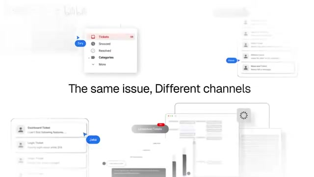

原片手法：白底打字，周围浅色界面碎片逐渐漂入，句尾出现蓝色选区后退格。

Fleqi 画面：中心字卡；周围只放真实 Finder、预览与 Terminal 的裁片。蓝色选区选中“来回切换工具”/“Too many tools”，再退格。

运动：保留原片中心留白、四周漂入和选中删字；背景裁片减淡，不裁成假应用窗口。

声音：按真实显字区间安排轻键盘音，退格短收。

素材：C01。对应输出帧：`[0, 174)`。

拍摄核验：周围窗口来自实际录屏或截图；不把 Fleqi 的功能界面描绘成其它工具。

### S02 · 重复步骤 · 00:05.8–00:07.9

原片手法：第二句打字完成，镜头突然推近大字并穿出。

Fleqi 画面：复用 S01 连续背景空间，第二句接替第一句；句尾问号落定后穿字。

运动：相机推近，不逐个字弹跳；保留清晰阅读停顿再加速。

声音：短上扬与穿字风声。

素材：C01。对应输出帧：`[174, 237)`。

拍摄核验：这是痛点字卡，不宣称具体节省时长。

### S03 · 转折 · 00:07.9–00:10.1

原片手法：柔焦大词缩小落定，白底带冷蓝边缘。

Fleqi 画面：先显“现在”/“Now”，后接余句；保持原片白底、轻透视和蓝色弥散光。

运动：由大到小，失焦到清晰；不做额外粒子。

声音：一记克制的转场声。

素材：字卡与品牌合成。对应输出帧：`[237, 303)`。

拍摄核验：一句话表示自然语言入口；后续镜头明确展示确认步骤。

### S04 · Fleqi 登场 · 00:10.1–00:13.0

原片手法：品牌引导词先放大，再缩回；图标和字标依次出现。

Fleqi 画面：使用 resources/icons 的真实蓝色文件夹与终端图标；Fleqi 字标排在右侧。

运动：继承原片字词推进、图标就位与蓝白渐变；字标完整后至少停 1 秒。

声音：轻品牌落点。

素材：A01。对应输出帧：`[303, 390)`。

拍摄核验：不用控制台左上角的通用 ⌘ 符号代替正式 App 图标。

### S05 · 一句话定义产品 · 00:13.0–00:16.3

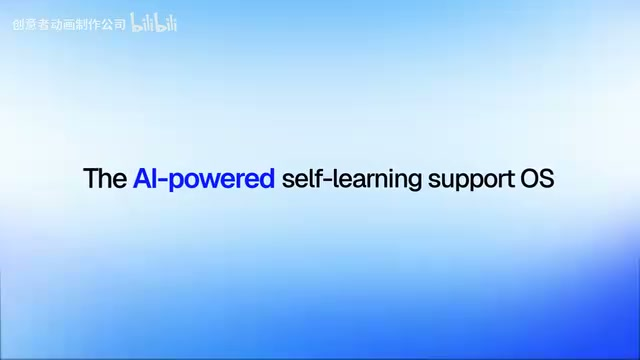

原片手法：产品定位逐段补齐，关键词变蓝。

Fleqi 画面：白色中心、冷蓝边缘；只突出 AI 和 Finder，不塞入功能列表。

运动：同原片词组揭示与轻缩放，完成后保持可读。

声音：短文字揭示声。

素材：字卡与品牌合成。对应输出帧：`[390, 489)`。

拍摄核验：Fleqi 是独立输入条配合 Finder，不把画面画成 Finder 内置功能。

### S06 · Finder 与输入条主镜头 · 00:16.3–00:20.8

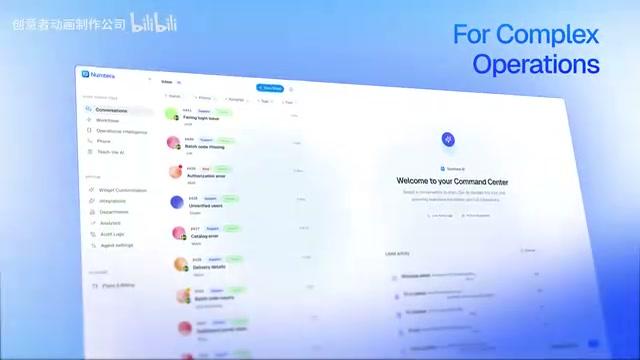

原片手法：完整产品窗口从下方倾斜升入，回正后推向左侧列表。

Fleqi 画面：真实 Finder 演示目录和下方 Fleqi 输入条作为完整一组升入；选中 Console.png、Finder.png 两个不透明 PNG。镜头推进选区与输入条。

运动：整组画面保持 Finder 与输入条相对位置，按原片轻倾斜、回正、推近。

声音：窗口进入风声，选中项轻点击。

素材：C02。对应输出帧：`[489, 624)`。

拍摄核验：真实读取两项选区；输入条已可见、目录有效，不使用附件中“已隐藏”的状态作为操作镜头。

### S07 · 输入自然语言 · 00:20.8–00:23.0

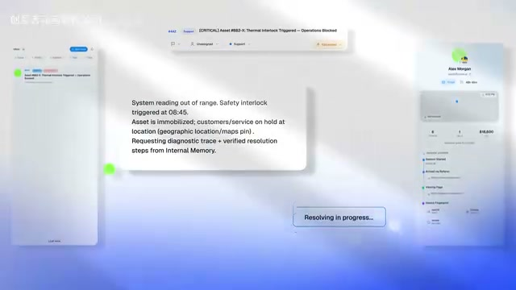

原片手法：界面拆成有前后景的局部卡片，中间内容获得焦点。

Fleqi 画面：这句是实际输入文本。推近输入条并提交；英文版另录英文输入。请求在后续真实任务面板继续可见，给足阅读时间。

运动：只对真实录屏作推近与景深；附件截图不能用于伪造打字或提交状态。

声音：键盘与提交点击。

素材：C03-ZH / C03-EN。对应输出帧：`[624, 690)`。

拍摄核验：提交到真实配置的模型；禁止用测试 fixture 或手工注入结果冒充 AI 调用。

### S08 · 上下文与计划 · 00:23.0–00:29.3

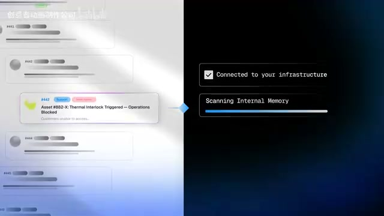

原片手法：左侧产品列表，右侧黑蓝面板；状态逐项出现。

Fleqi 画面：左侧保持 Finder 选区；右侧放真实 Fleqi 任务面板，经历规划中到待确认，能看到实际命令、输入和输出意图。

运动：保留左右分屏比例、中央分界和冷蓝背景；右侧 UI 保持原色，不套原片的黑色假状态框。

声音：轻分屏转场，真实状态落定声。

素材：C03-ZH / C03-EN / C04。对应输出帧：`[690, 879)`。

拍摄核验：只放 App 实际展示的信息；若计划无法精确列出影响，保留原有提示，不后期补画确定性清单。

### S09 · 执行由你确认 · 00:29.3–00:31.3

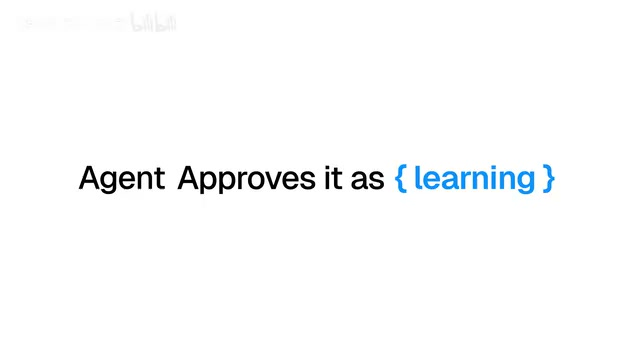

原片手法：纯白字卡，蓝色括号强调一个关键词。

Fleqi 画面：“确认执行”/“run it”以蓝色强调；继续使用默认 AI 策略的同一次任务。

运动：词组依次出现，收束到下一镜头的真实确认按钮。

声音：文字揭示与短吸入。

素材：字卡与品牌合成。对应输出帧：`[879, 939)`。

拍摄核验：这是 AI 修改任务的默认流程，不暗示手动终端也有 AI 确认。

### S10 · 确认按钮特写 · 00:31.3–00:33.5

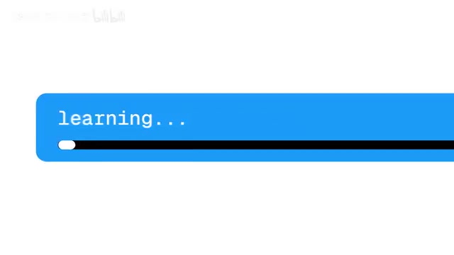

原片手法：长条元素从侧面放大穿入，再缩成中央小组件。

Fleqi 画面：特写真实任务面板中的“确认执行”，鼠标点击，再拉回整个面板。英文标题位于画面外，不改按钮文字。

运动：沿用条形元素的横向拉近与缩回；元素尺寸与位置来自真实界面。

声音：真实点击钉在按下帧。

素材：C04。对应输出帧：`[939, 1005)`。

拍摄核验：不复制参考片的 learning 进度条，也不凭空添加百分比。

### S11 · 结果真实落盘 · 00:33.5–00:39.8

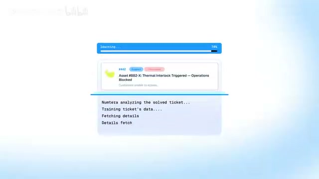

原片手法：中央小面板显示多行处理过程，最后完成状态替换。

Fleqi 画面：前半显示同一任务真实运行与输出；后半切到 Finder 中新生成的两个 JPG，Quick Look 打开一个结果。字幕只在结果核验后出现。

运动：保持原片中央主体与由过程到结果的替换；末尾结果至少清晰停留 1.5 秒。

声音：细小阶段声与完成落点。

素材：C05。对应输出帧：`[1005, 1194)`。

拍摄核验：验证 JPG 可解码、宽度为 1600、两份原图哈希未变；不能仅凭 UI 成功字样通过。

### S12 · 从一次到常用 · 00:39.8–00:42.3

原片手法：进入深蓝场景，短句由大变小并补齐。

Fleqi 画面：蓝黑弥散背景，短句在中心由大到小。

运动：复刻深浅场景转换与字卡纵深。

声音：低频轻转场。

素材：字卡与品牌合成。对应输出帧：`[1194, 1269)`。

拍摄核验：只引出显式收藏，不宣称自动学习用户行为。

### S13 · 可复用的指令 · 00:42.3–00:44.7

原片手法：关键词被左右蓝色方括号夹住，随后向中心压缩退出。

Fleqi 画面：蓝色括号只属于片中文字设计，下一镜直接落到 Fleqi 的真实收藏。

运动：保留括号包围、文字保持、横向收束的顺序。

声音：克制括号落点。

素材：字卡与品牌合成。对应输出帧：`[1269, 1341)`。

拍摄核验：不写“越用越聪明”“永久学习”等缺少产品依据的承诺。

### S14 · 真实收藏复用 · 00:44.7–00:47.0

原片手法：返回产品列表，光标选择一个条目。

Fleqi 画面：展示实际能力库的收藏区，选择预先保存的“图片转 JPG · 1600px”，点击“复用”展开内容与当前目录。

运动：轻斜视进入后回正阅读，光标只完成一次主操作。

声音：一次真实点击。

素材：C06。对应输出帧：`[1341, 1410)`。

拍摄核验：收藏是显式保存的提示，不暗示这次任务被自动学会；复用重新绑定当前上下文。

### S15 · 复用收益 · 00:47.0–00:49.8

原片手法：大字从透视角度翻正，短暂清晰后失焦离开。

Fleqi 画面：沿用原片蓝黑字卡；不出现自动执行或免确认字样。

运动：字卡轻倾斜回正，落定后停留，再柔焦退出。

声音：短转场风声。

素材：字卡与品牌合成。对应输出帧：`[1410, 1494)`。

拍摄核验：收藏减少重复输入，不替代权限与当前 AI 策略。

### S16 · 转向手动终端 · 00:49.8–00:55.3

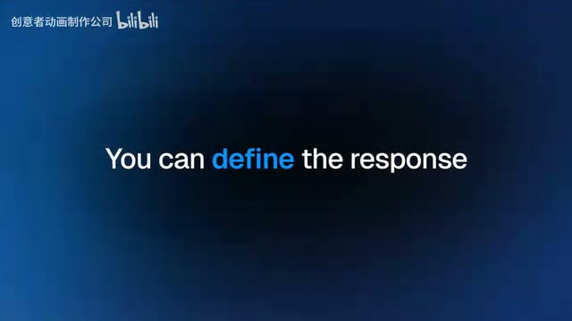

原片手法：巨大的连接词之后，两张短字卡依次替换，关键词变蓝。

Fleqi 画面：三句依次出现，不同屏堆叠。半角 ! 成为下一镜输入条的视觉接点。

运动：保留巨词缩回、短句切换、单词蓝色强调。

声音：三个词组落点按原片视觉节奏安排。

素材：字卡与品牌合成。对应输出帧：`[1494, 1659)`。

拍摄核验：手动 ! 直通真实 PTY，与前半的 AI 规划路径明确区分。

### S17 · ! 切换模式 · 00:55.3–00:57.4

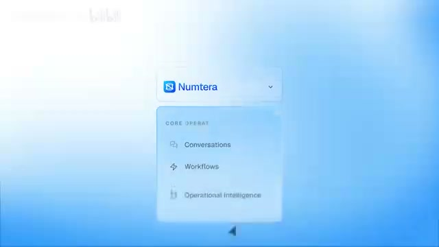

原片手法：一个小型真实菜单从中心展开。

Fleqi 画面：裁取真实输入条，输入 !；文字变绿、手动终端标识出现。

运动：沿用小主体展开的节奏，真实模式变化由 App 自己完成。

声音：单次按键拟音。

素材：C07。对应输出帧：`[1659, 1722)`。

拍摄核验：保留颜色与文字双重标识；不后期绘制模式徽标。

### S18 · 真实终端展开 · 00:57.4–01:00.4

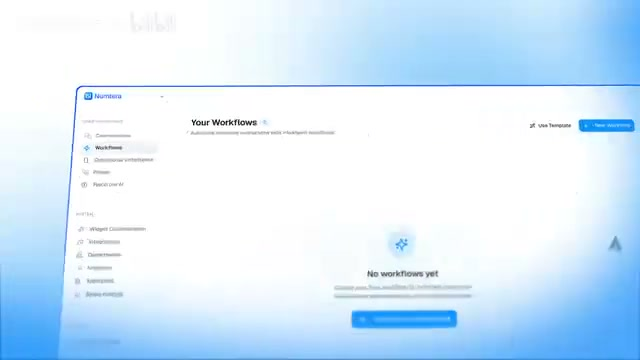

原片手法：菜单过渡到完整窗口，窗口在蓝白背景中斜向浮起。

Fleqi 画面：点击实际终端入口，持续 PTY 面板展开，出现真实 shell 提示符。Finder、输入条和终端保持真实位置关系。

运动：整组录屏作轻倾斜运镜；App 自身展开动画按原速保留。

声音：面板展开轻风声。

素材：C07。对应输出帧：`[1722, 1812)`。

拍摄核验：真实 zsh 与可输入提示符；不把 AI 输出排成假的终端。

### S19 · 命令输入的微距 · 01:00.4–01:05.7

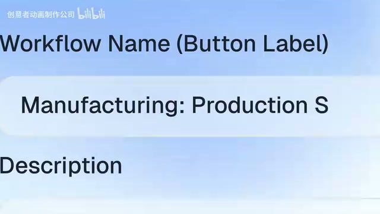

原片手法：表单输入区微距横移，逐字输入后拉回。

Fleqi 画面：在同一演示目录的输入条真实输入命令并提交，列出刚生成的 JPG。中英两版均保留原始命令。

运动：摄影式推近输入区、横移跟随文本、拉回到终端；以源采集分辨率限制最大放大。

声音：实际长度的键盘声与 Enter。

素材：C08。对应输出帧：`[1812, 1971)`。

拍摄核验：命令由 Fleqi 去掉 ! 后发送 PTY；终端路径必须就是 Finder 演示目录。

### S20 · 输出可以核对 · 01:05.7–01:12.0

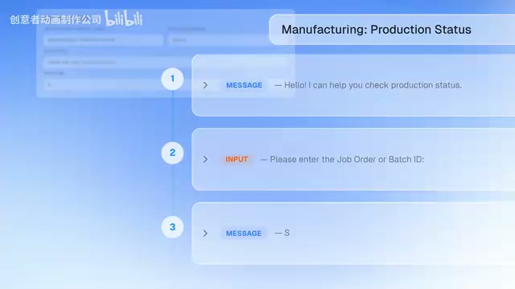

原片手法：三条内容逐层堆叠、局部对焦，背景表单保持。

Fleqi 画面：真实终端先后执行 pwd、ls -lh *.jpg、file *.jpg。用真实输出的三个裁片依次前移，源终端仍在后方。末帧能核对两个输出文件及 1600px 宽度。

运动：匹配三层内容堆叠节奏；裁片来自同一录制，不手打输出。

声音：三个轻落点，响度递减。

素材：C08。对应输出帧：`[1971, 2160)`。

拍摄核验：目录与结果一致；输出如果含长用户名路径，优先在画面构图中避开，不伪造短路径。

### S21 · 用完收起 · 01:12.0–01:14.8

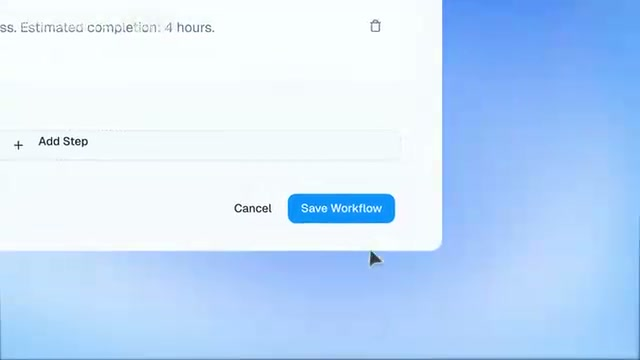

原片手法：保存按钮微距点击，再拉远退出。

Fleqi 画面：特写实际终端面板收起按钮，点击后面板消失，Fleqi 输入条保留。

运动：复用按钮特写到拉远的动作；按钮在真实左上角，镜头移动到按钮，不挪动 UI。

声音：真实点击加离场短风声。

素材：C09。对应输出帧：`[2160, 2244)`。

拍摄核验：收起终端不等于结束会话；镜头不展示误导性的“已结束”。

### S22 · 能力范围总览 · 01:14.8–01:17.0

原片手法：完整工作流页面浮起，后方有一层页面残影。

Fleqi 画面：使用真实控制台概览，六类入口全景与浅景深。它是能力范围的短收束，不代替实际演示。

运动：保留完整窗口倾斜入场与轻拉远；不把六块卡片改成不存在的悬浮仪表盘。

声音：轻窗口入场声。

素材：C10。对应输出帧：`[2244, 2310)`。

拍摄核验：数量使用录制时真实目录，不将全部条目称为已完整验收。

### S23 · 三种能力合流 · 01:17.0–01:18.6

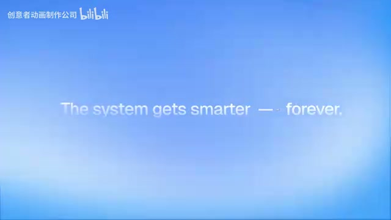

原片手法：界面退走，蓝白背景上的一句短宣言。

Fleqi 画面：三词依次聚拢；不再加新功能或新 UI。

运动：与原片页面离场连续，文字落定。

声音：轻收束。

素材：字卡与品牌合成。对应输出帧：`[2310, 2358)`。

拍摄核验：只总结刚刚演示的三项。

### S24 · 第一句品牌主张 · 01:18.6–01:21.0

原片手法：巨大黑字缩小进入白色中心。

Fleqi 画面：黑字白心蓝边，镜头由近到远，句号落定。

运动：继承原片大字缩小和停顿。

声音：一记文字落点。

素材：字卡与品牌合成。对应输出帧：`[2358, 2430)`。

拍摄核验：不延用原片对竞争产品的比较句。

### S25 · 第二句品牌主张 · 01:21.0–01:23.4

原片手法：蓝色主张句取代黑字，中心亮区扩散。

Fleqi 画面：品牌蓝强调动词，亮区保持原片层次。

运动：文字替换与轻推近，避免额外震屏。

声音：品牌强调落点。

素材：字卡与品牌合成。对应输出帧：`[2430, 2502)`。

拍摄核验：此前已交代真实确认步骤；不承诺所有任务一次成功。

### S26 · 品牌落版 · 01:23.4–01:26.8

原片手法：居中图标先出现，再逐字形成品牌名称。

Fleqi 画面：真实 App 图标与 Fleqi 字标居中；完整品牌至少停留 1.2 秒。

运动：保持图标大小、水平关系和字标揭示方式接近原片。

声音：短品牌落点，自然余韵。

素材：A01。对应输出帧：`[2502, 2604)`。

拍摄核验：保持正式图标原有蓝色和细节，不由 AI 重绘。

### S27 · 最终定位 · 01:26.8–01:29.8

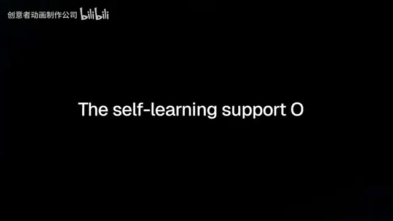

原片手法：黑底打字定位句，少量边缘蓝光。

Fleqi 画面：黑底居中文字与打字光标，蓝光只保留在边缘。

运动：保留原片打字与退格节奏；最终读完才切 CTA。

声音：轻键盘声，配乐开始退场。

素材：字卡与品牌合成。对应输出帧：`[2604, 2694)`。

拍摄核验：强调 Finder 工作流，不写原片的自动学习定位。

### S28 · 开源入口 · 01:29.8–01:33.2

原片手法：黑蓝背景上的 CTA，底部小网址。

Fleqi 画面：主 CTA 居中，底部 github.com/Fleqi-App/fleqi；采用原片的留白和小网址位置。

运动：轻打字形成 CTA，尾段渐暗；不展示未经核实的发行版本号。

声音：配乐淡出，避免突断。

素材：字卡与品牌合成。对应输出帧：`[2694, 2796)`。

拍摄核验：仓库地址已核对本地 origin；发布前核查公开入口。无订阅或免费试用文案。

### S29 · 余韵与黑场 · 01:33.2–01:35.3

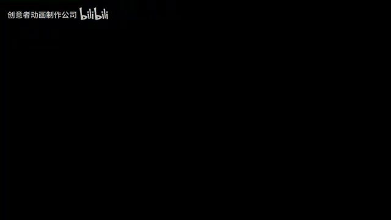

原片手法：CTA 淡出后进入黑场。

Fleqi 画面：字幕、蓝光与音轨一同收干净。

运动：保留原片结束呼吸与黑场，实际输出总长 2858 帧。

声音：短余韵归零。

素材：字卡与品牌合成。对应输出帧：`[2796, 2858)`。

拍摄核验：无残留一帧文字、参考片品牌或平台水印。
