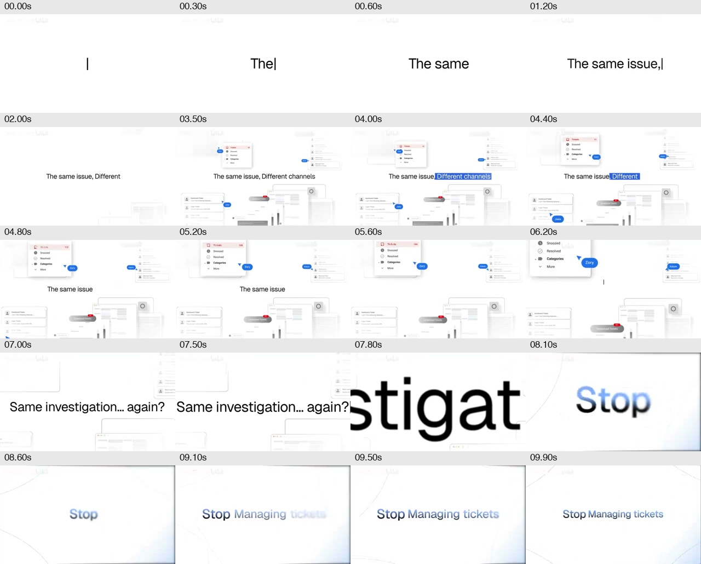
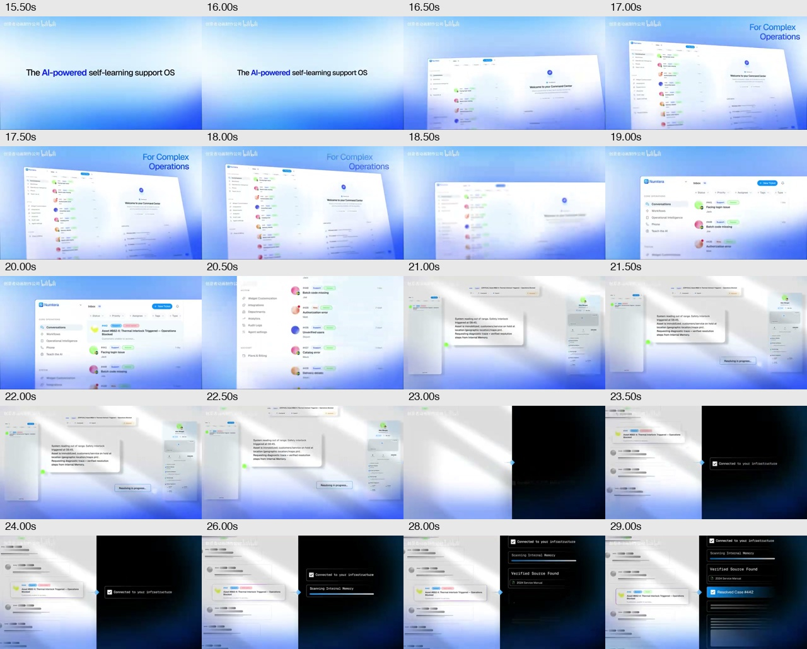
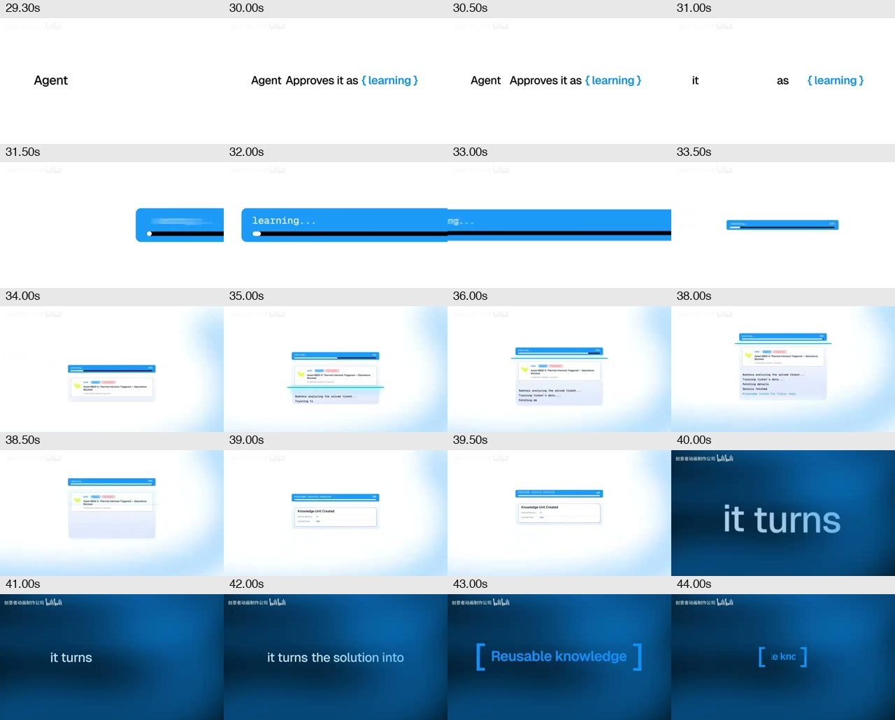
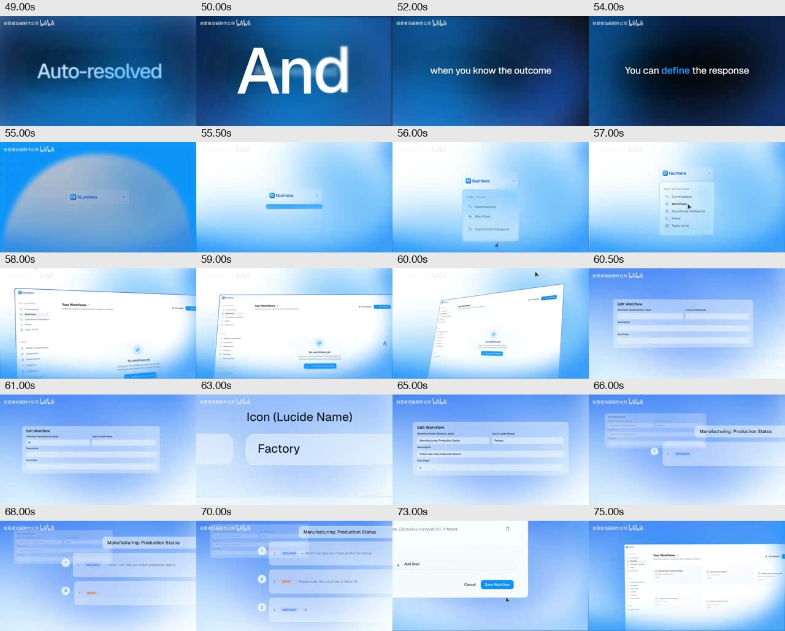
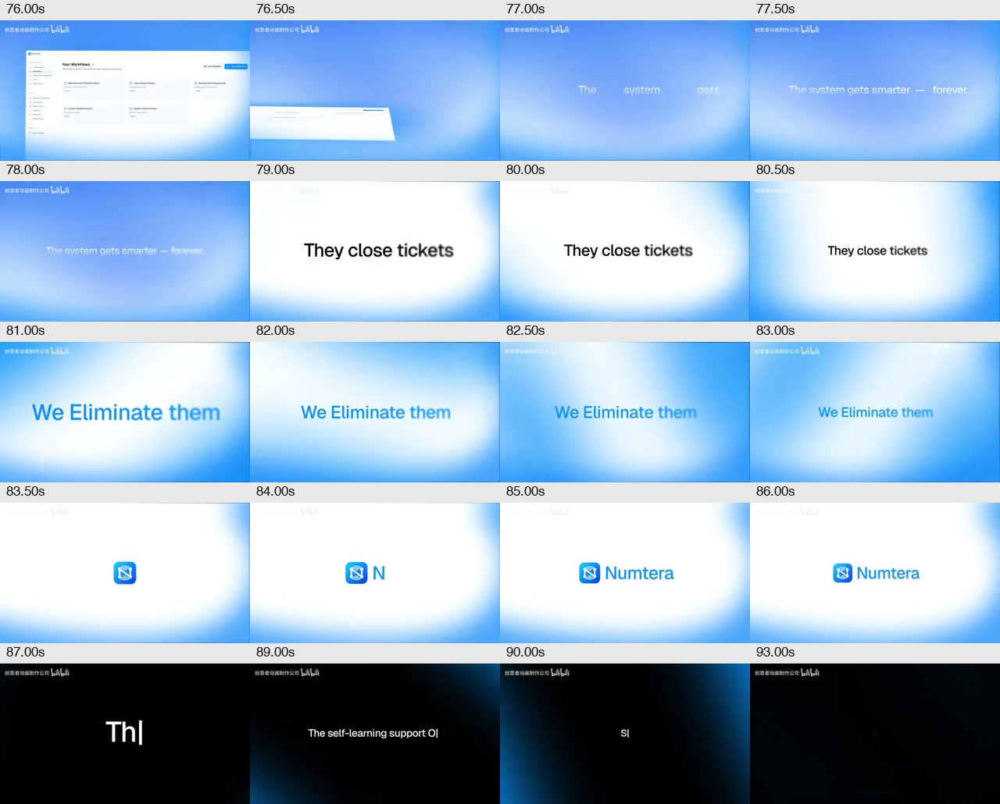

# 参考片拆解与适配

源文件：`/Users/trip/Downloads/39791035415-1-16.MP4`。副本保存在 [assets/reference.mp4](assets/reference.mp4)，仅供方案内部对照，**不是 Fleqi 宣传片**。

## 检查范围

已检查全片约一秒间隔的 95 张抽样帧，并对开场、相机、处理中段、工作流编辑和结尾额外抽取 100 张指定时间帧。关键段见下方五张联系表。所有画面来自给定视频，没有从另一模板推断原片内容。

视频流：640×360，H.264 High，名义 30fps，2858 帧，时长 95.266625 秒。音轨：AAC、双声道、44.1kHz；容器总长 95.317914 秒。元数据见 [reference-metadata.json](reference-metadata.json)。

原片可见品牌为 Numtera，讲述客服问题、解决与学习、工作流编辑。本项目片沿用它的摄影与剪辑结构，业务内容改为 Fleqi 的 Finder、自然语言、确认、文件结果、收藏和 PTY。不能把原片的产品能力、CTA、logo 或平台水印带入新片。

## 镜头语言

| 参考位置（近似秒） | 观察到的手法 | Fleqi 适配 |
|---|---|---|
| 0–5.8 | 白底中心打字，四周淡色 UI 碎片；蓝色文本选区、退格改句 | 保留动作；碎片改用真实 Finder、预览、Terminal |
| 5.8–7.9 | 第二个问题句放大，穿字转场 | 保留构图、节奏与穿镜方向 |
| 7.9–10.1 | 大词缩小、柔焦落清晰、边缘冷光 | 改为“现在，一句话” |
| 10.1–13 | 引导词、图标、字标依次进入 | 使用 Fleqi 正式图标与品牌名 |
| 13–16.3 | 定位字卡，蓝色强调关键词 | 改为 Finder 中的 AI 操作 |
| 16.3–20.8 | 完整窗口倾斜升起，回正并推向列表，景深转移 | 改为 Finder + 输入条整体；选区成为视线焦点 |
| 20.8–23 | 界面局部分层悬浮，光从后方扫过 | 使用输入条与任务面板的真实局部，不画假卡片 |
| 23–29.3 | 左亮右暗分屏，右侧过程状态递进 | 右侧展示 Fleqi 真实规划与确认面板；不保留原片的内部记忆扫描 |
| 29.3–31.3 | 白底短句，蓝色括号强调 | 改为计划与用户确认 |
| 31.3–39.8 | 长条组件横向放大后缩小；中央面板持续处理到完成 | 改为真实确认按钮、运行面板和 Finder 输出；原片百分比不复用 |
| 39.8–44.7 | 深蓝字卡，关键词方括号收束 | 改为显式收藏复用，不宣称自动学习 |
| 44.7–49.8 | 返回列表，再用透视大字作结果宣告 | 拍真实收藏复用入口，强调少打重复指令 |
| 49.8–55.3 | 巨大连接词，两张承接字卡 | 改为“熟悉命令？输入 !” |
| 55.3–60.4 | 中央小菜单展开到完整斜视窗口 | 改为 ! 模式与真实终端展开 |
| 60.4–65.7 | 表单微距横移、跟随输入、拉回 | 对应真实命令输入；不额外造工作流编辑器 |
| 65.7–72 | 三行逐层入场，前后景深 | 对应真实终端目录、列表与格式核对输出 |
| 72–74.8 | 按钮点击特写、镜头拉回 | 改为真实终端收起；按钮位置服从产品 UI |
| 74.8–78.6 | 页面全景、后层残影、宣言 | Fleqi 六类能力概览与“文件。AI。终端。” |
| 78.6–83.4 | 黑色主张句换成蓝色结果句 | 改为“选好文件 / 说一句，开始做” |
| 83.4–86.8 | 图标先落，字标形成，停留 | Fleqi 图标和字标 |
| 86.8–93.2 | 黑底打字定位句，切 CTA 和小网址 | Finder 定位、开源入口、自选模型 |
| 93.2–95.27 | 黑场余韵 | 保留结束节奏 |

时间边界为抽帧辅助的制作拟定值。源片转场常跨越相邻段落，不能据此声称反推出原作者的图层、准确 Bézier 曲线或焦距。正式制作要在关键转场两侧继续取相邻帧，比较运动位置与清晰度。

## 对照帧

### 开场：打字、选中、退格与穿字

### 产品主镜头：倾斜、回正、分层与左右分屏

### 执行段：局部组件、过程与括号字卡

### 长演示：菜单到窗口、输入微距、逐层内容

### 品牌与结尾

## 声音的已知与待验证项

FFmpeg `ebur128=peak=true` 测得全曲约 -9.9 LUFS，LRA 2.3 LU，最大真峰值 +2.0 dBTP。5 秒 RMS 分段显示约 10 秒时能量明显进入，此后总体平稳，90 秒后开始收尾。

简单频谱通量自相关给出约 107.67、71.78、143.55 等多个周期候选，存在节拍层级歧义，**这些不是经验证的 BPM**。本轮未完成听检、语音识别、鼓轨分离、网格覆盖率检验，不能据此判断旁白或音乐曲目。数据见 [audio-analysis.json](audio-analysis.json)。

后续声音阶段先试听参考与候选 BGM，在确定配乐后拟合节拍和真实瞬态。锁定画面以后给键盘、点击与窗口动作逐帧配音；两种语言使用同一音乐结构。最终输出不保留源视频音频编码的峰值过载。

## 原片到 Fleqi 的必要改写

| 原片叙事功能 | Fleqi 对应 | 为什么这样处理 |
|---|---|---|
| 客服工单与多渠道 | 文件与多个工具之间切换 | 贴近 Finder 工作流 |
| 内部记忆扫描 | 实际 Finder 上下文和生成计划 | 当前确有实现，实机可拍 |
| 批准学习 | 确认执行一次 AI 修改任务 | 保留用户控制与计划预览 |
| 学习百分比 | 真实运行状态和输出 | 当前细粒度进度未完整交付，不造百分比 |
| 自动解决 | 显式收藏复用 | 产品没有原片那种自学习承诺 |
| 可视化工作流编辑器 | ! 输入、持续 PTY 与真实输出 | 终端是 Fleqi 的核心，原片表单不是本项目功能 |
| 试用 CTA | 开源项目入口 | Fleqi 没有试用、激活或订阅 |

本轮没有重画产品 UI，也没有生成看起来像已完成的功能演示。正式录制的真实性要求见 [采集方案](capture-plan.md)。
